# Laboratório CCNA — Rede Corporativa Hierárquica (Cisco Packet Tracer)

Documentação de um laboratório de estudos para a certificação **CCNA**, simulando uma rede corporativa de médio porte em Cisco Packet Tracer, seguindo o **modelo hierárquico de três camadas** (Core, Distribution, Access).

O projeto cobre, de ponta a ponta: VLANs e trunking, EtherChannel (LACP e PAgP, L2 e L3), Spanning Tree (Rapid-PVST+, PortFast, BPDU Guard), HSRP balanceado por VLAN, OSPF com adjacências `point-to-point` e ECMP, segurança de gerência (SSH + ACL) e serviços de rede (DHCP/DHCP Relay para dados e voz).

Cada capítulo documenta não apenas os comandos aplicados, mas o raciocínio por trás de cada decisão de design — e os problemas reais encontrados (e resolvidos) durante a montagem, como parte legítima do processo de aprendizado.

**Tecnologias e protocolos abordados:** `VLANs` · `VTP` · `802.1Q Trunking` · `EtherChannel (LACP / PAgP)` · `Rapid-PVST+` · `PortFast` · `BPDU Guard` · `HSRP` · `OSPF (point-to-point, ECMP)` · `SSH` · `ACL Padrão` · `DHCP / DHCP Relay` · `VoIP (Voice VLAN)`

## Índice

- [Capítulo 0 — Visão Geral da Topologia e Lógica de Design](#capitulo-0)
- [Capítulo 1 — Configurações Iniciais, VTP/VLANs, EtherChannel e Portas de Acesso](#capitulo-1)
- [Capítulo 2 — Interfaces Roteadas, Loopbacks e EtherChannel Layer 3](#capitulo-2)
- [Capítulo 3 — Spanning Tree (Rapid-PVST) e HSRP](#capitulo-3)
- [Capítulo 4 — OSPF](#capitulo-4)
- [Capítulo 5 (Final) — Serviços IP: SSH, ACL, DHCP Relay e Verificação Prática](#capitulo-5)


```
ccna-lab-enterprise-network/
├── README.md
└── imagens/
    ├── capitulo-0/   → TOPOLOGIA.png, TOPOLOGIA_EXCEL.PNG
    ├── capitulo-1/   → CONFIGS-INICIAIS.PNG, VTP-SERVER.PNG, ETHERCHANNEL-TRUNK.PNG, INT-ACCESS.PNG
    ├── capitulo-2/   → IP-ADD-DSW.PNG, ETHERCHANNEL-L3-DSW-IP-ADD.PNG, R1-IPS.PNG
    ├── capitulo-3/   → PORTFAST-BPDUGUARD.PNG, PER-VLAN-SPANNING-TREE.PNG, HRSP-GROUP.PNG
    ├── capitulo-4/   → OSPF.PNG
    └── capitulo-5/   → SSH.PNG, DHCP-RELAY.PNG, DHCP.PNG, STANDARD-ACL.PNG, ACESSO-SSH.PNG
```

---

<a id="capitulo-0"></a>
## Capítulo 0 — Visão Geral da Topologia e Lógica de Design

### Objetivo do laboratório

Este projeto simula, em Cisco Packet Tracer, uma rede corporativa de médio porte seguindo o **modelo hierárquico de três camadas** (Core, Distribution, Access). O objetivo não foi apenas "fazer os dispositivos se enxergarem", mas reproduzir decisões de design que se justificam por redundância, segregação de tráfego e boas práticas de operação — os mesmos princípios cobrados na certificação CCNA.

Ao longo dos próximos capítulos, cada camada e protocolo será detalhado com sua configuração e o raciocínio por trás das escolhas. Este capítulo 0 serve como mapa geral: como a topologia está desenhada e por quê.

### A topologia

```
```

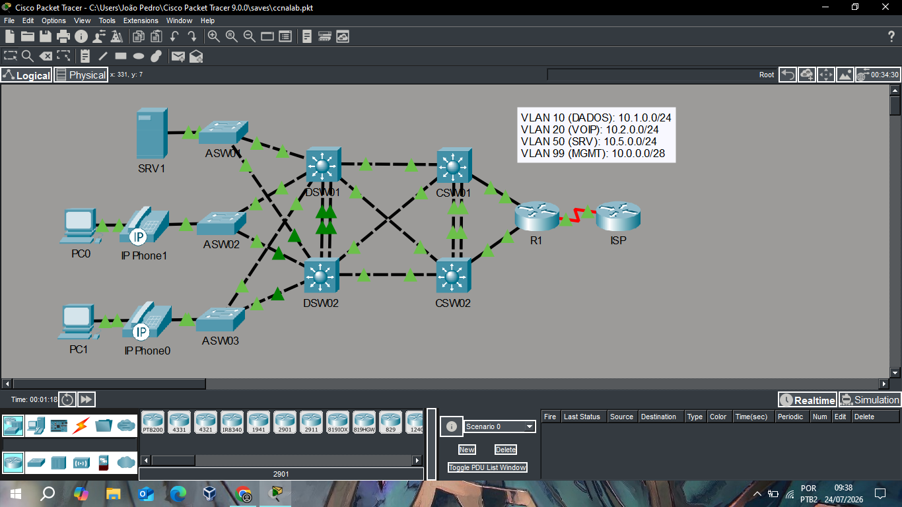
*Topologia física completa montada no Packet Tracer.*

A rede é dividida em três camadas funcionais:

| Camada | Dispositivos | Função |
|---|---|---|
| **Acesso** | ASW01, ASW02, ASW03 (2960) | Conectam os dispositivos finais (PCs, servidor, telefones IP) |
| **Distribuição** | DSW01, DSW02 (3650) | Fronteira entre Layer 2 e Layer 3; ponto onde as VLANs "terminam" |
| **Core** | CSW01, CSW02 (3650) | Backbone roteado, sem VLANs, só encaminha entre os blocos de distribuição e a borda com a internet |
| **Borda** | R1 (roteador) → ISP | Saída para a internet |

### Por que essa divisão em camadas

O ponto central desse desenho — e a decisão que mais moldou as configurações discutidas nos capítulos seguintes — é que **os switches de distribuição são a fronteira entre L2 e L3**, enquanto o **Core é 100% roteado**.

Isso significa:

- Os ASWs enviam tráfego em **trunks 802.1Q** para os DSWs, carregando todas as VLANs necessárias (dados, voz, servidores, gerência).
- Os DSWs possuem uma **SVI para cada VLAN**, fazem **HSRP** (redundância de gateway) e são o **STP Root** dessas VLANs.
- Os enlaces **DSW → CSW** são interfaces **roteadas puras** (`no switchport`), sem nenhuma VLAN configurada — apenas endereços ponto-a-ponto /30 e OSPF.
- Os CSWs, por consequência, **não têm VLANs, não fazem STP e não fazem HSRP** — eles só existem para rotear pacotes IP entre os dois blocos de distribuição e destes para a saída à internet.

Essa separação evita um erro comum de design: tentar estender VLANs de usuário até o núcleo da rede. Um núcleo puramente roteado tem convergência mais previsível (depende de OSPF, não de STP), menos superfície de problemas de Layer 2 (loops, tempestades de broadcast) e escala melhor à medida que mais blocos de distribuição são adicionados.

### Redundância física e lógica

A topologia foi desenhada para que **nenhum ponto único de falha** interrompa o tráfego:

- Cada ASW é conectado a **ambos** os DSWs (uplinks redundantes em X).
- Cada DSW é conectado a **ambos** os CSWs, e os dois DSWs entre si por um **EtherChannel** dedicado.
- Cada CSW tem um link independente para o roteador de borda (R1), permitindo balanceamento de carga por **ECMP** via OSPF, em vez de depender de rota estática de contingência.

Como existem múltiplos caminhos físicos formando loops (necessários para a redundância), o **Spanning Tree Protocol** entra em ação nas camadas de acesso e distribuição para bloquear logicamente os caminhos redundantes e evitar loops — sem eliminar a redundância física, que continua disponível caso o caminho ativo falhe.

### Segmentação por VLANs

Foram definidas quatro VLANs, cada uma isolando um tipo de tráfego:

| VLAN | Nome | Rede | Gateway (VIP HSRP) |
|---|---|---|---|
| 10 | Dados | 10.1.0.0/24 | 10.1.0.1 |
| 20 | Voz (VoIP) | 10.2.0.0/24 | 10.2.0.1 |
| 50 | Servidores | 10.5.0.0/24 | 10.5.0.1 |
| 99 | Gerência (nativa) | 10.0.0.0/28 | 10.0.0.1 |

A separação de voz e dados na mesma porta física (usando `switchport voice vlan`) segue a prática padrão de telefonia IP: o telefone tagueia seu próprio tráfego na VLAN de voz via CDP, enquanto o PC conectado atrás dele permanece na VLAN de dados, sem tagging algum — as duas convivem na mesma porta sem se misturar.

A VLAN de gerência (99) é a nativa dos trunks e existe apenas para administração remota (SSH) dos switches de acesso e distribuição — os switches Core, por não terem VLANs, usam **interfaces Loopback** para o mesmo propósito, sempre alcançáveis via OSPF independente de qual link físico esteja ativo.

### Endereçamento dos links internos (Core e Distribuição)

Os enlaces ponto-a-ponto entre DSWs, CSWs e o roteador de borda usam blocos /30 dedicados, documentados integralmente na planilha de endereçamento (`/addressing/ip-plan.xlsx`). Cada link tem seu próprio par de IPs, nomeado pela convenção `Origem > Destino` (ex: `DSW1 > CSW1`), o que facilita tanto a auditoria da configuração quanto a leitura das tabelas de roteamento OSPF nos capítulos seguintes.

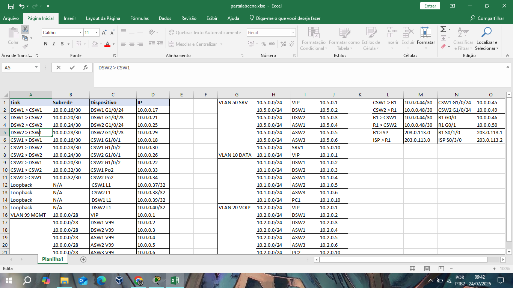
*Plano de endereçamento completo: links ponto-a-ponto, VLANs e Loopbacks.*

### O que vem a seguir

Os próximos capítulos desta documentação cobrem, em ordem:

1. **VLANs e Trunking** — configuração nos switches de acesso e distribuição
2. **Spanning Tree e EtherChannel** — redundância de Layer 2 entre distribuição
3. **HSRP** — redundância de gateway por VLAN, incluindo o troubleshooting real de uma incompatibilidade de versão (v1 x v2) encontrada durante a montagem do laboratório
4. **OSPF** — roteamento entre distribuição, core e borda, incluindo o uso de `point-to-point` nos enlaces dedicados e ECMP para balanceamento da saída à internet
5. **Segurança de gerência** — SSH, ACLs de acesso remoto e uso de Loopback nos switches Core
6. **Telefonia IP** — segregação de voz/dados, DHCP relay e considerações sobre TFTP/CallManager Express

Cada capítulo apresenta não só o comando aplicado, mas o motivo da escolha e, quando relevante, os erros encontrados no caminho — parte real de qualquer processo de aprendizado em redes.

---

<a id="capitulo-1"></a>
## Capítulo 1 — Configurações Iniciais, VTP/VLANs, EtherChannel e Portas de Acesso

Este capítulo cobre a primeira camada de configuração aplicada aos switches: da segurança básica de acesso até a criação das VLANs, a formação do EtherChannel entre os switches de distribuição e a configuração das portas de acesso que atendem PCs e telefones IP.

### 1.1 Configuração inicial (hardening básico)

Antes de qualquer VLAN ou protocolo de roteamento, todo switch da rede recebe uma configuração-base de identificação e segurança de linha de console:

```
Switch(config)#host DSW01
DSW01(config)#enable secret ccna
DSW01(config)#username admin secret ccna
DSW01(config-line)#login local
DSW01(config-line)#exec-timeout 10
DSW01(config-line)#logging syn
DSW01(config)#no ip domain-lookup
DSW01(config)#service password-encryption
```

O que cada linha resolve:

- **`hostname`**: identifica o dispositivo nos logs e no prompt — essencial já com múltiplos switches na mesma topologia (DSW01, DSW02, CSW01, CSW02, ASW01-03).
- **`enable secret`**: senha do modo privilegiado, armazenada com hash (diferente de `enable password`, que fica em texto claro).
- **`username ... secret` + `login local`**: cria uma base de autenticação local, usada tanto no console quanto, mais adiante, no acesso SSH.
- **`exec-timeout 10`**: desconecta sessões de console ociosas após 10 minutos — evita sessões administrativas abertas indefinidamente.
- **`logging synchronous`**: reorganiza a exibição de mensagens de log no console para não interromper um comando sendo digitado no meio da tela — puramente uma melhoria de usabilidade durante a operação.
- **`no ip domain-lookup`**: evita que o switch tente resolver, via DNS, qualquer palavra digitada errada no prompt (comportamento padrão do IOS gera um travamento de alguns segundos tentando consultar um servidor DNS inexistente a cada erro de digitação).
- **`service password-encryption`**: aplica um hash reversível simples (tipo 7) a todas as senhas em texto claro no `running-config` — não é forte o suficiente para senhas críticas (por isso `enable secret` já usa hash forte por padrão), mas evita exposição trivial ao "olhar por cima do ombro" de uma config impressa ou exportada.

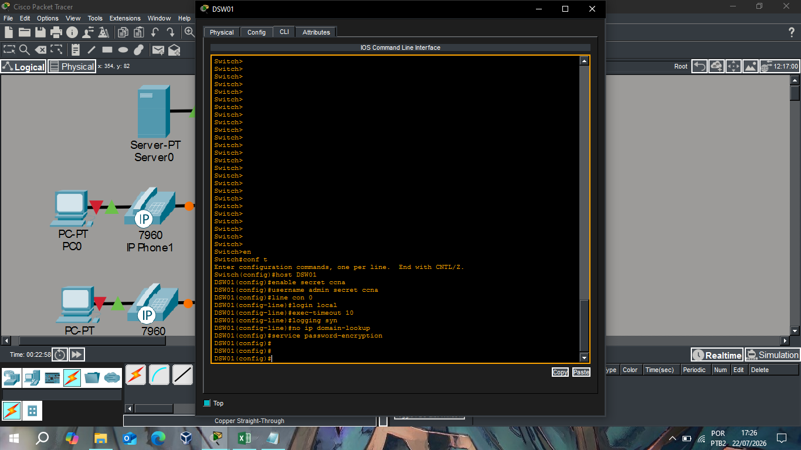
*Hardening básico aplicado antes de qualquer configuração de VLAN.*

Essa base é replicada (com o hostname correspondente) em todos os switches de acesso, distribuição e core antes de qualquer configuração específica de camada.

### 1.2 VTP e criação das VLANs

As VLANs são criadas uma única vez, no switch de distribuição configurado como **VTP Server**, e propagadas automaticamente para os demais switches do mesmo domínio:

```
DSW01(config)#vtp domain CCNA
Changing VTP domain name from NULL to CCNA
DSW01(config)#vlan 10
DSW01(config-vlan)#name DATA
DSW01(config-vlan)#vlan 20
DSW01(config-vlan)#name VOIP
DSW01(config-vlan)#vlan 50
DSW01(config-vlan)#name SVR
DSW01(config-vlan)#vlan 99
DSW01(config-vlan)#name MGMT
%SW_VLAN-6-VTP_DOMAIN_NAME_CHG: VTP domain name changed to CCNA.
```

Pontos importantes dessa etapa:

- **`vtp domain CCNA`** precisa ser configurado *antes* de qualquer VLAN — é o que define o domínio de sincronização. Switches com domínio diferente (ou nulo) ignoram atualizações VTP recebidas.
- O DSW01 atua como **VTP Server** (modo padrão do IOS), responsável por criar/editar VLANs e distribuir essas mudanças via VTP para os switches em modo **Client** (tipicamente os ASWs e o DSW02, dependendo de como o VTP foi propagado na topologia).
- As quatro VLANs criadas correspondem exatamente ao desenho apresentado no Capítulo 0: **10 (DATA)**, **20 (VOIP)**, **50 (SVR)** e **99 (MGMT)**.
- A mensagem `%SW_VLAN-6-VTP_DOMAIN_NAME_CHG` é apenas uma confirmação informativa do IOS — não indica erro.

**Nota de boas práticas**: em uma rede de produção real, normalmente se usaria **VTP versão 3** ou mesmo **modo Transparent** com VLANs configuradas manualmente em cada switch, já que o VTP em versões 1/2 tem um histórico conhecido de risco (um switch com revision number mais alto, mesmo apagando VLANs, pode sobrescrever acidentalmente todo o domínio). Para fins deste laboratório e por simplicidade didática, optou-se pelo modelo VTP Server/Client tradicional.

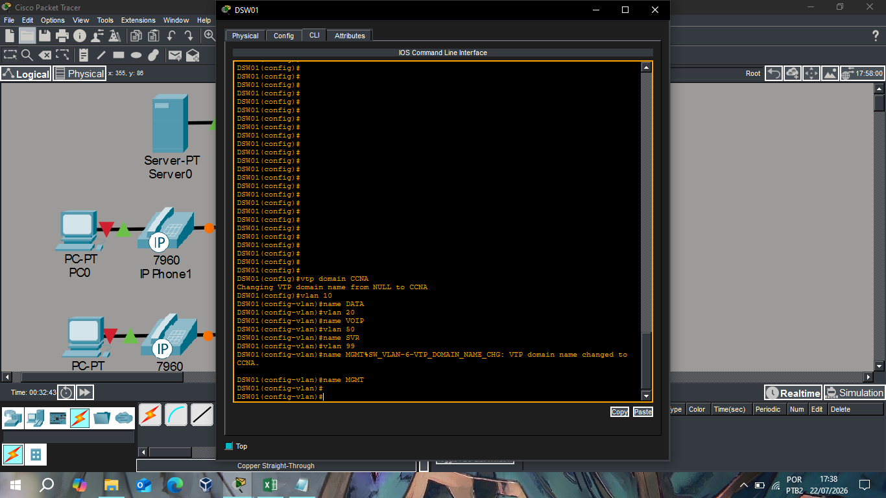
*DSW01 configurado como VTP Server, criando as 4 VLANs do domínio CCNA.*

### 1.3 EtherChannel e Trunk entre os switches de distribuição

O link redundante entre DSW01 e DSW02 (duas portas físicas agregadas) é configurado como **EtherChannel** usando **LACP**, e o Port-channel resultante é configurado como trunk:

```
DSW01(config)#int ran g1/0/4-5
DSW01(config-if-range)#channel-group 1 mode active
%EC-5-L3DONTBUNDL2: Gig1/0/4 suspended: LACP currently not enabled on the remote port.
%EC-5-L3DONTBUNDL2: Gig1/0/5 suspended: LACP currently not enabled on the remote port.
DSW01(config-if-range)#int po1
DSW01(config-if)#sw mode tr
DSW01(config-if)#sw tr allow vlan 10,20,50,99
DSW01(config-if)#sw tr native vlan 99
Creating a port-channel interface Port-channel 1
```

Detalhando cada comando:

- **`interface range g1/0/4-5`**: seleciona as duas portas físicas que formarão o EtherChannel.
- **`channel-group 1 mode active`**: agrupa as duas portas no Port-channel 1, usando **LACP** (indicado por `active` — o switch inicia ativamente a negociação, em vez de `passive`, que só responde se o outro lado iniciar).
- As mensagens **`%EC-5-L3DONTBUNDL2 ... suspended: LACP currently not enabled on the remote port`** são **esperadas e temporárias** neste ponto: elas aparecem porque o DSW02 (do outro lado do link) ainda não tinha o `channel-group` configurado no momento em que o DSW01 já estava tentando negociar LACP. Assim que a mesma configuração espelhada for aplicada no DSW02, essas portas saem do estado "suspended" e o Port-channel sobe normalmente — por isso não representam um erro de configuração, apenas a ordem natural de se configurar as duas pontas de um EtherChannel.
- **`interface po1`**: a partir daqui, a configuração de trunk é feita **na interface lógica do Port-channel**, não nas portas físicas individualmente — o IOS propaga a configuração para os membros automaticamente.
- **`switchport mode trunk`**: define a porta lógica como trunk (necessário para carregar múltiplas VLANs).
- **`switchport trunk allow vlan 10,20,50,99`**: restringe explicitamente quais VLANs podem atravessar esse trunk — evitando que VLANs futuras, criadas por engano ou por terceiros, se propaguem automaticamente por esse link.
- **`switchport trunk native vlan 99`**: define a VLAN 99 (gerência) como nativa do trunk, ou seja, tráfego dessa VLAN trafega **sem tag 802.1Q**. É essencial que esse valor seja **idêntico nos dois lados do trunk** — uma divergência aqui gera `%CDP-4-NATIVE_VLAN_MISMATCH`, como mencionado em capítulos anteriores desta série de decisões de design.

As mensagens subsequentes de **`LINEPROTO-5-UPDOWN`** alternando entre `down` e `up` nas interfaces físicas são o reflexo normal da negociação de LACP e da formação do Port-channel — as portas físicas oscilam brevemente enquanto o protocolo sincroniza os dois lados antes de estabilizar como membros ativos do Po1.

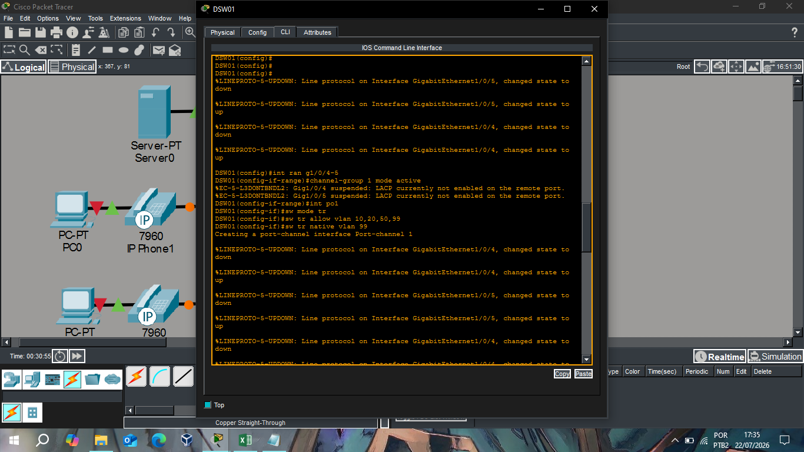
*Formação do Port-channel 1 (LACP) e configuração de trunk com VLAN nativa 99.*

### 1.4 Portas de acesso: dados e voz na mesma porta física

Nas portas dos switches de acesso que atendem PC + telefone IP no mesmo cabo (ex: ASW02, porta atendendo PC0 + IP Phone1), a configuração é:

```
ASW02(config-if)#int f0/1
ASW02(config-if)#sw mode acc
ASW02(config-if)#sw voice vlan 20
ASW02(config-if)#sw acc vlan 10
```

- **`switchport mode access`**: define a porta como access — o telefone é quem cuida do tagging 802.1Q internamente, o switch não precisa (nem deve) ser configurado como trunk aqui.
- **`switchport voice vlan 20`**: instrui o switch a anunciar, via CDP, que o tráfego de voz deve usar a VLAN 20. O telefone recebe essa informação automaticamente e passa a taguear seus próprios frames.
- **`switchport access vlan 10`**: define a VLAN de dados (untagged) usada pelo PC conectado atrás do telefone.

Essa combinação permite que **dados e voz compartilhem a mesma porta física e o mesmo cabo**, mas trafeguem em VLANs completamente separadas — dados na VLAN 10 sem tag, voz na VLAN 20 com tag 802.1Q — sem exigir configuração de trunk manual nem qualquer intervenção do usuário final.

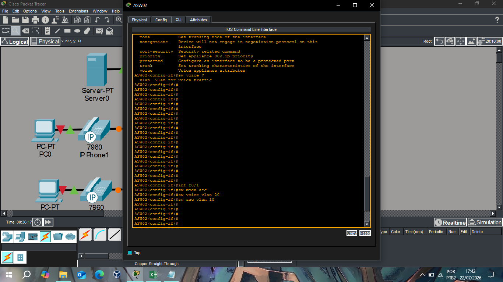
*Configuração da porta f0/1 do ASW02: VLAN 10 (dados) + VLAN 20 (voz).*

### Resumo do capítulo

| Etapa | Onde | Resultado |
|---|---|---|
| Hardening inicial | Todos os switches | Acesso local seguro, hostname, timeout de sessão |
| VTP + VLANs | DSW01 (VTP Server) | 4 VLANs propagadas para todo o domínio VTP |
| EtherChannel + Trunk | DSW01 ↔ DSW02 | Link redundante agregado, carregando as 4 VLANs, nativa 99 |
| Portas de acesso | ASWs | Dados e voz segregados na mesma porta física |

O próximo capítulo aborda a camada de Spanning Tree — como o Root Bridge é definido nos switches de distribuição e como isso se relaciona com a redundância física apresentada aqui.

---

<a id="capitulo-2"></a>
## Capítulo 2 — Interfaces Roteadas, Loopbacks e EtherChannel Layer 3 (Distribuição, Core e Borda)

Este capítulo cobre a transição de Layer 2 para Layer 3 na rede: como os switches de distribuição e core passam a rotear entre si, como o EtherChannel é usado também num contexto puramente L3 entre os dois switches Core, e como as interfaces do roteador de borda (R1) se conectam a esse núcleo.

### 2.1 Habilitando o roteamento nos switches multilayer

Diferente dos switches de acesso (L2 puro), os switches de distribuição (DSW01/DSW02) e core (CSW01/CSW02) são multilayer (3650) e precisam ter o roteamento IP habilitado explicitamente antes de qualquer interface poder operar como L3:

```
DSW01(config)#ip routing
```
```
CSW01(config)#ip routing
```

Sem esse comando, o switch continua operando exclusivamente em Layer 2 mesmo que IPs sejam atribuídos às interfaces — é `ip routing` que ativa o processo de encaminhamento entre redes diferentes e, mais adiante, o processo do OSPF.

### 2.2 Interfaces roteadas ponto-a-ponto

Cada link entre distribuição e core é configurado como uma interface **roteada pura** — sem VLAN, sem trunk, apenas um endereço IP diretamente na interface física:

```
DSW01(config)#int g1/0/24
DSW01(config-if)#no sw
DSW01(config-if)#ip add 10.0.0.17 255.255.255.252
DSW01(config-if)#int g1/0/23
DSW01(config-if)#no sw
DSW01(config-if)#ip add 10.0.0.21 255.255.255.252
```

- **`no switchport`** (`no sw`) remove a interface do modo padrão de switch e a converte em uma interface puramente roteada — é o comando que "transforma" uma porta de switch numa porta equivalente a uma interface de roteador.
- Cada link usa uma sub-rede **/30** dedicada (apenas dois hosts possíveis: as duas pontas do enlace), seguindo a convenção documentada na planilha de endereçamento do Capítulo 0.
- **G1/0/24 → CSW01** (10.0.0.16/30) e **G1/0/23 → CSW02** (10.0.0.20/30): o DSW01 mantém dois caminhos físicos independentes para os dois switches Core, consistente com a topologia redundante definida desde o início do projeto.

O mesmo padrão se repete em DSW02 e nos dois switches Core, cada um com suas próprias interfaces roteadas apontando para os vizinhos correspondentes.

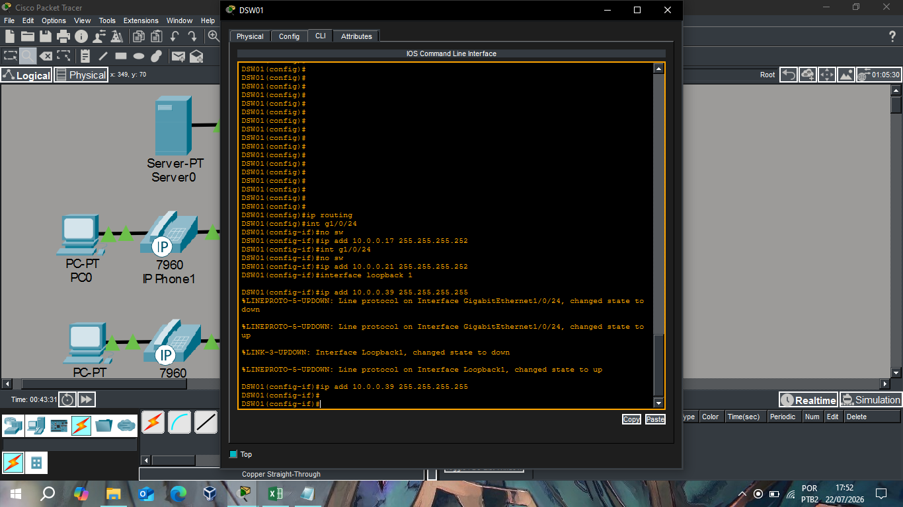
*DSW01: `ip routing`, interfaces roteadas para CSW01/CSW02 e Loopback1.*

### 2.3 EtherChannel Layer 3 entre os switches Core

O link entre CSW01 e CSW02 também é agregado em EtherChannel — mas, diferente do EtherChannel L2 configurado entre DSW01 e DSW02 no capítulo anterior, aqui a agregação ocorre **sobre interfaces já roteadas**, formando um Port-channel L3 com um único endereço IP:

```
CSW01(config)#ip routing
CSW01(config)#int ran g1/0/3-4
CSW01(config-if-range)#no sw
CSW01(config-if-range)#channel-group 1 mode desirable
%EC-5-L3DONTBUNDL2: Gig1/0/3 suspended: PAGP currently not enabled on the remote port.
%EC-5-L3DONTBUNDL2: Gig1/0/4 suspended: PAGP currently not enabled on the remote port.
CSW01(config-if-range)#int po1
CSW01(config-if)#ip add 10.0.0.33 255.255.255.252
```

Alguns pontos que diferenciam esta configuração da do Capítulo 1:

- **`no switchport` antes do `channel-group`**: garante que as duas portas físicas já estejam em modo roteado antes de entrarem na agregação — o resultado é um Port-channel que se comporta como uma única interface **roteada**, com apenas um IP (10.0.0.33/30), em vez de uma interface trunk carregando VLANs.
- **`channel-group 1 mode desirable`**: aqui foi usado **PAgP** (protocolo proprietário Cisco) em vez do LACP usado no Capítulo 1 entre DSW01 e DSW02. Isso foi intencional para fins de estudo — o resultado funcional é equivalente (agregação de links com negociação automática), mas o mecanismo de negociação difere: PAgP é exclusivo de equipamentos Cisco, enquanto LACP é um padrão aberto (IEEE 802.3ad). Documentar os dois protocolos no mesmo laboratório permite comparar a configuração e o comportamento de ambos lado a lado.
- As mensagens **`%EC-5-L3DONTBUNDL2 ... PAGP currently not enabled on the remote port`** seguem a mesma lógica já observada no Capítulo 1: são temporárias, refletindo apenas que o CSW02 ainda não tinha o `channel-group` espelhado no momento da configuração do CSW01. Assim que a configuração equivalente é aplicada do outro lado, a suspensão é removida e o Port-channel L3 sobe normalmente.

Essa agregação faz parte da mesma lógica de redundância física discutida no Capítulo 0: mesmo com os dois links entre CSW01 e CSW02 fisicamente separados, o OSPF (configurado no próximo capítulo) enxerga apenas uma interface lógica (Po1), simplificando a topologia de roteamento sem abrir mão da capacidade agregada e da tolerância à falha de um dos cabos.

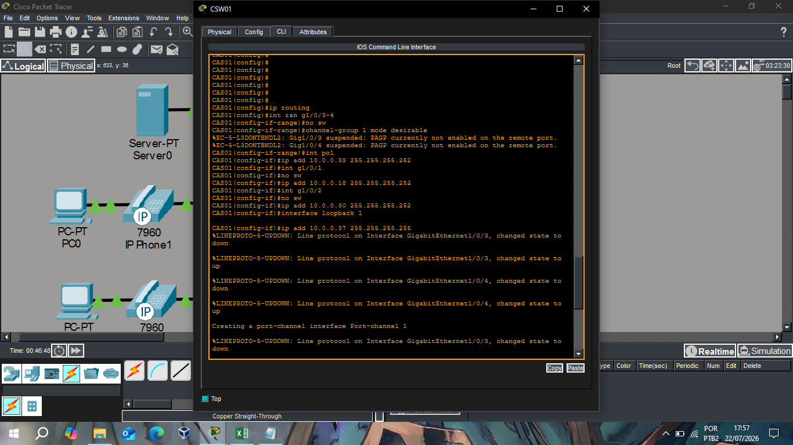
*CSW01: `ip routing`, EtherChannel L3 (PAgP) para CSW02, interfaces para DSW01/DSW02 e Loopback1.*

### 2.4 Interfaces Loopback para gerência e identificação OSPF

Cada switch de distribuição e core recebe uma interface **Loopback** dedicada:

```
DSW01(config-if)#interface loopback 1
DSW01(config-if)#ip add 10.0.0.39 255.255.255.255
```
```
CSW01(config-if)#interface loopback 1
CSW01(config-if)#ip add 10.0.0.37 255.255.255.255
```

Como discutido anteriormente nesta documentação, a Loopback existe porque os switches Core não possuem nenhuma VLAN (logo, nenhuma SVI de gerência possível) — a Loopback resolve isso de forma mais robusta que atribuir IP diretamente numa interface física, já que:

- **Nunca cai**, independente do estado de qualquer link físico.
- É **anunciada no OSPF** junto com as demais redes, ficando alcançável por qualquer caminho redundante disponível.
- Serve também como **Router ID** estável do processo OSPF (configurado no capítulo seguinte), evitando que o Router ID mude automaticamente caso a interface física usada como referência anterior sofra alguma alteração de estado.

O uso da máscara `/32` (255.255.255.255) é proposital: uma Loopback representa um único host lógico, não uma sub-rede — não há razão para reservar um range maior de endereços.

### 2.5 Roteador de borda (R1): interfaces para os dois Core switches

O R1, ponto de saída da rede para o ISP, recebe duas interfaces roteadas independentes — uma para cada switch Core, preservando a redundância até a borda:

```
R1(config)#int g0/0
R1(config-if)#no shut
R1(config-if)#ip add 10.0.0.46 255.255.255.252
R1(config-if)#int g0/1
R1(config-if)#no shut
R1(config-if)#ip add 10.0.0.50 255.255.255.252
```

- **G0/0 → CSW01** (rede 10.0.0.44/30)
- **G0/1 → CSW02** (rede 10.0.0.48/30)

As mensagens `%LINK-5-CHANGED` e `%LINEPROTO-5-UPDOWN` confirmam que ambas as interfaces subiram corretamente assim que conectadas — nenhuma ação adicional foi necessária além do `no shutdown` (interfaces de roteador, diferente de interfaces de switch, iniciam administrativamente desligadas por padrão).

Com essas duas interfaces ativas e endereçadas, o R1 está pronto para formar adjacências OSPF `point-to-point` com CSW01 e CSW02 — exatamente como planejado nos capítulos anteriores desta documentação, permitindo o balanceamento ECMP da rota default entre os dois Core switches.

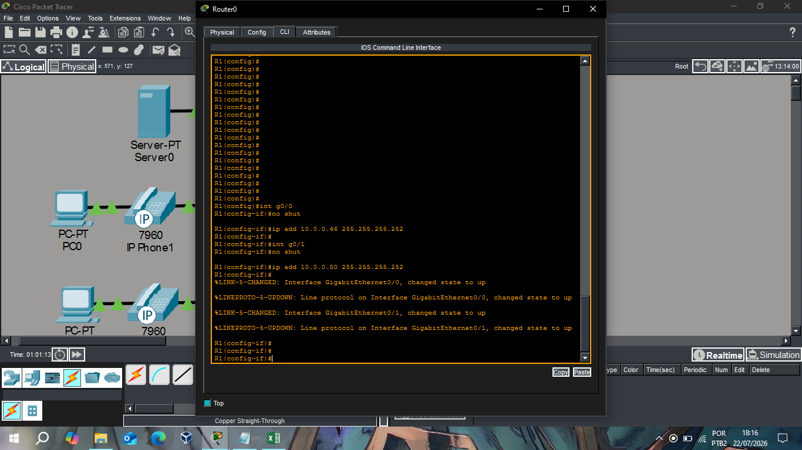
*R1: G0/0 → CSW01 (10.0.0.44/30) e G0/1 → CSW02 (10.0.0.48/30).*

### Resumo do capítulo

| Elemento | Dispositivos | Endereçamento |
|---|---|---|
| Interfaces roteadas DSW → CSW | DSW01, DSW02 | Blocos /30 dedicados por link |
| EtherChannel L3 (PAgP) | CSW01 ↔ CSW02 | Po1 — 10.0.0.32/30 |
| Loopback (gerência/Router ID) | DSW01, DSW02, CSW01, CSW02 | /32 individuais |
| Interfaces roteadas CSW → R1 | R1 | 10.0.0.44/30 e 10.0.0.48/30 |

O próximo capítulo aborda a configuração do OSPF propriamente dita: tipo de rede `point-to-point`, custo igual para ECMP, uso das Loopbacks como Router ID e a originação da rota default a partir do R1.

---

<a id="capitulo-3"></a>
## Capítulo 3 — Spanning Tree (Rapid-PVST) e HSRP: Redundância de Layer 2 e de Gateway

Este capítulo fecha o ciclo de redundância da rede iniciado no Capítulo 0: como o Spanning Tree é configurado nas pontas (acesso) e no núcleo de distribuição (com prioridade balanceada por VLAN), e como o HSRP é configurado para que cada switch de distribuição assuma o papel de gateway ativo de um subconjunto de VLANs — exatamente o desenho de balanceamento planejado desde o início deste projeto.

### 3.1 PortFast e BPDU Guard nas portas de acesso

Nas portas dos switches de acesso conectadas diretamente a dispositivos finais (PCs, servidores, telefones IP), duas proteções de Spanning Tree são aplicadas:

```
ASW01(config)#int f0/1
ASW01(config-if)#span portfast
%Warning: portfast should only be enabled on ports connected to a single
 host. Connecting hubs, concentrators, switches, bridges, etc... to this
 interface  when portfast is enabled, can cause temporary bridging loops.
 Use with CAUTION
%Portfast has been configured on FastEthernet0/1 but will only
 have effect when the interface is in a non-trunking mode.
ASW01(config-if)#span bpduguard en
```

- **`spanning-tree portfast`**: faz a porta pular diretamente para o estado *forwarding*, sem passar pelos estágios de *listening* e *learning* do STP (que juntos levam ~30 segundos por padrão). Isso é seguro **apenas em portas de acesso final**, onde não existe risco de loop físico — daí o aviso do próprio IOS alertando sobre o risco caso a porta acabe conectada a outro switch/hub por engano.
- **`spanning-tree bpduguard enable`**: complementa o PortFast com uma proteção ativa — se essa porta **receber um BPDU** (sinal de que um switch, e não um host final, foi conectado ali), a porta é automaticamente colocada em **err-disabled**, desligando-a. Isso evita que alguém conecte um switch não autorizado (ou crie um loop acidental) numa porta que deveria ter apenas um PC ou telefone.

Essa combinação é considerada boa prática padrão em todas as portas de acesso final da rede, e foi replicada em ASW01, ASW02 e ASW03.

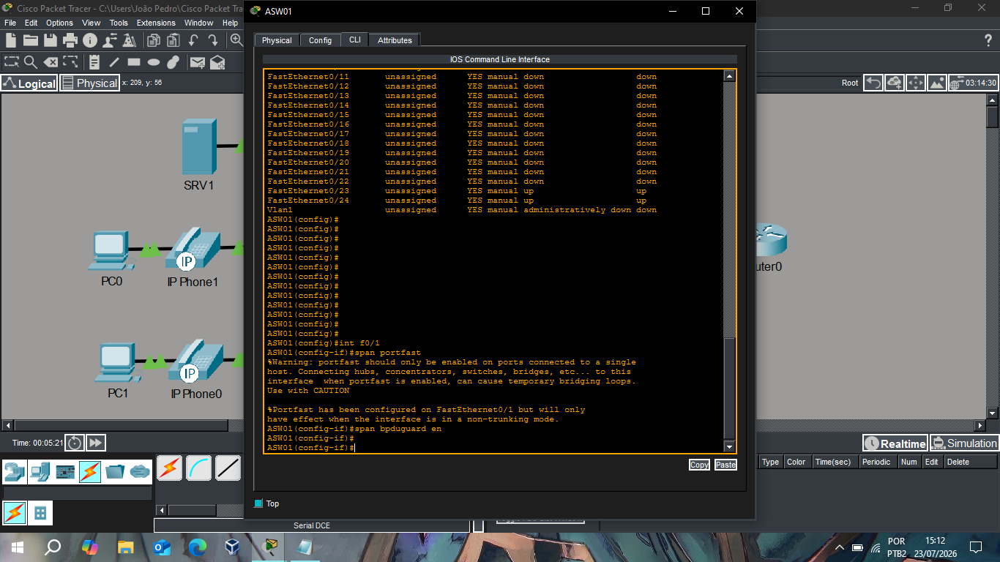
*Proteções aplicadas na porta de acesso final f0/1 do ASW01.*

### 3.2 Rapid-PVST+ e prioridade de Root Bridge por VLAN

No núcleo de distribuição, o modo de STP é definido explicitamente como **Rapid-PVST+** (uma instância de Spanning Tree por VLAN, com convergência rápida via 802.1w):

```
DSW01(config)#span mode rapid-pvst
```

Assim que o modo é alterado, o STP é reprocessado em todas as VLANs — por isso é normal observar uma breve oscilação de estado nos protocolos que dependem da estabilidade de Layer 2, como visto nos logs de HSRP logo em seguida (`Standby -> Active -> Standby`), causada pela reconvergência momentânea do STP durante a troca de modo. Em uma rede de produção, esse tipo de mudança deveria ser feito em janela de manutenção, justamente por esse efeito colateral temporário.

Em seguida, a prioridade de Root Bridge é definida **por grupo de VLANs**, implementando o balanceamento de papéis entre DSW01 e DSW02 discutido desde o planejamento inicial deste projeto:

```
DSW01(config)#span vlan 10,50 priority 0
DSW01(config)#span vlan 20,99 priority 4096
```

- **VLANs 10 (Dados) e 50 (Servidores)**: prioridade **0**, o menor valor possível — garante que o **DSW01** seja o Root Bridge primário para essas duas VLANs (quanto menor a prioridade, mais preferido como raiz da árvore STP).
- **VLANs 20 (Voz) e 99 (Gerência)**: prioridade **4096** no DSW01 — um valor mais alto, tornando o DSW01 **menos preferido** como raiz nessas VLANs. O DSW02 (configuração espelhada, não mostrada aqui) recebe prioridade 0 para essas mesmas VLANs, assumindo o papel de Root primário nelas.

O resultado é que **nenhum dos dois switches de distribuição concentra todo o tráfego de Root Bridge** — cada um é primário para duas das quatro VLANs, e secundário (backup) para as outras duas, distribuindo carga e evitando um ponto único de concentração de tráfego em condições normais de operação.


*Mudança para Rapid-PVST+ e ajuste de prioridade por grupo de VLANs (também mostra o `show standby brief` da seção 3.4).*

### 3.3 HSRP por VLAN: grupos, prioridade e preempt

Alinhado exatamente à mesma lógica de distribuição usada no Root Bridge, o HSRP é configurado por VLAN no DSW01:

```
DSW01(config)#int vlan 10
DSW01(config-if)#ip add 10.1.0.2 255.255.255.0
DSW01(config-if)#standby version 2
DSW01(config-if)#standby 10 ip 10.1.0.1
DSW01(config-if)#standby 10 priority 150
DSW01(config-if)#standby 10 preempt

DSW01(config-if)#int vlan 50
DSW01(config-if)#ip add 10.5.0.2 255.255.255.0
DSW01(config-if)#standby version 2
DSW01(config-if)#standby 30 ip 10.5.0.1
DSW01(config-if)#standby 30 priority 150
DSW01(config-if)#standby 30 preempt

DSW01(config-if)#int vlan 20
DSW01(config-if)#ip add 10.2.0.2 255.255.255.0
DSW01(config-if)#standby version 2
DSW01(config-if)#standby 20 ip 10.2.0.1

DSW01(config-if)#int vlan 99
DSW01(config-if)#ip add 10.0.0.2 255.255.255.240
DSW01(config-if)#standby version 2
DSW01(config-if)#standby 40 ip 10.0.0.1
```

O padrão de configuração confirma o mesmo balanceamento já definido no Spanning Tree:

- **VLANs 10 e 50**: `priority 150` + `preempt` no DSW01 — prioridade mais alta (o padrão HSRP é 100) garante que o DSW01 assuma e **retome** o papel de Active sempre que estiver disponível, mesmo após uma falha e posterior recuperação (`preempt` é o que permite essa retomada automática; sem ele, o switch que assumiu como Active durante a falha continuaria ativo mesmo depois do preferencial voltar ao ar).
- **VLANs 20 e 99**: nenhuma prioridade customizada é definida no DSW01 (permanece no padrão 100) — o DSW02 é quem recebe prioridade 150 + preempt nessas VLANs, assumindo o papel de Active para elas.

Os identificadores de grupo HSRP (`standby 10`, `standby 30`, `standby 20`, `standby 40`) não seguem necessariamente o número da VLAN — são apenas identificadores locais ao link, únicos por VLAN/interface, e não precisam ser numericamente idênticos ao ID da VLAN (prática comum, mas não obrigatória).

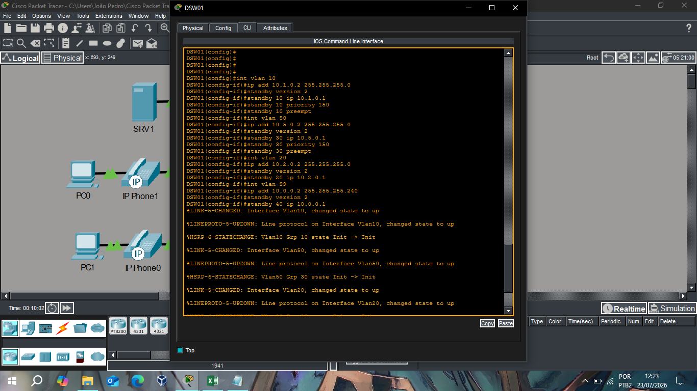
*Grupos HSRP configurados para as VLANs 10, 50, 20 e 99, com prioridade e preempt.*

### 3.4 Verificação: resultado combinado de STP + HSRP

O comando `show standby brief` confirma o resultado prático do design:

```
DSW01(config)#do sh stand br
                     P indicates configured to preempt.
                     |
Interface   Grp  Pri P  State    Active      Standby     Virtual IP
Vl10        10   150 P  Active   local       unknown     10.1.0.1
Vl50        30   150 P  Active   local       10.5.0.3    10.5.0.1
Vl20        20   100    Standby  10.2.0.3    local       10.2.0.1
Vl99        40   100    Standby  10.0.0.3    local       10.0.0.1
```

| VLAN | Root Bridge primário | HSRP Active | HSRP Standby |
|---|---|---|---|
| 10 (Dados) | DSW01 | DSW01 | DSW02 |
| 50 (Servidores) | DSW01 | DSW01 | DSW02 |
| 20 (Voz) | DSW02 | DSW02 | DSW01 |
| 99 (Gerência) | DSW02 | DSW02 | DSW01 |

Esse alinhamento entre Root Bridge e HSRP Active na mesma VLAN, no mesmo switch, não é coincidência — é uma prática recomendada intencional: quando o switch que é gateway ativo (HSRP) também é o Root Bridge daquela VLAN, o caminho do tráfego local até o gateway é sempre o mais curto possível dentro da topologia de Layer 2, evitando que o tráfego precise "voltar" desnecessariamente por um switch não-root antes de alcançar o roteamento.

**Nota de verificação**: no momento da captura mostrada acima, a coluna *Standby* da VLAN 10 aparece como `unknown` — indicando que a adjacência com o par (DSW02) ainda não havia sido totalmente estabelecida naquele instante (reflexo da reconvergência do STP mencionada na seção 3.2). Após a estabilização completa da rede, o comando deve ser reexecutado para confirmar que todas as quatro VLANs mostram um Standby válido nos dois lados — um `unknown` persistente indicaria um problema de adjacência a investigar (nos mesmos moldes do troubleshooting de HSRPv1/v2 documentado em capítulos anteriores).

### Resumo do capítulo

| Mecanismo | Onde aplicado | Objetivo |
|---|---|---|
| PortFast + BPDU Guard | Portas de acesso final (ASWs) | Convergência rápida + proteção contra switches não autorizados |
| Rapid-PVST+ | Todos os switches de distribuição | Convergência rápida de STP por VLAN (802.1w) |
| Prioridade de Root por VLAN | DSW01 / DSW02 | Balanceamento de tráfego: cada switch é raiz de 2 das 4 VLANs |
| HSRP por VLAN | DSW01 / DSW02 | Gateway redundante, alinhado ao mesmo switch Root de cada VLAN |

O próximo capítulo (4) aborda o OSPF: adjacências `point-to-point` entre distribuição, core e borda, uso das interfaces Loopback como Router ID, e a originação da rota default para balanceamento ECMP na saída à internet.

---

<a id="capitulo-4"></a>
## Capítulo 4 — OSPF: Processo, Adjacências Point-to-Point e Router ID via Loopback

Este capítulo documenta a configuração do OSPF no núcleo da rede — o protocolo responsável por rotear entre distribuição, core e a borda com a internet, amarrando tudo que foi construído nos capítulos anteriores (interfaces roteadas, EtherChannel L3, Loopbacks) em uma topologia funcional e redundante.

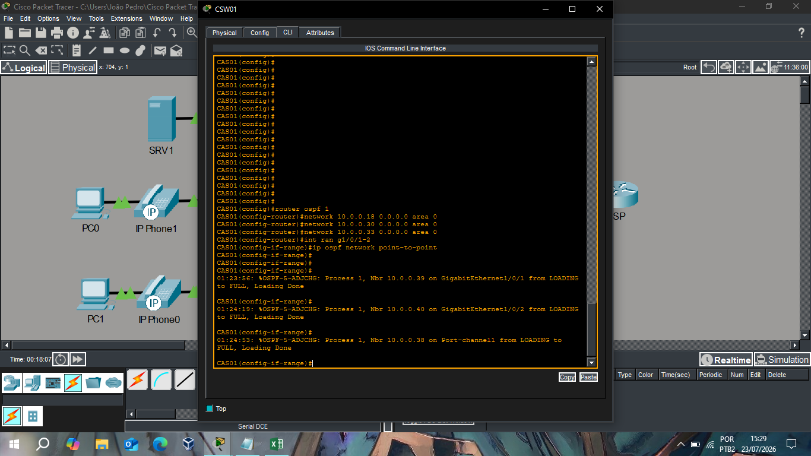
*CSW01: processo OSPF, redes anunciadas, tipo point-to-point e adjacências FULL.*

### 4.1 Processo OSPF e redes anunciadas

No CSW01, o processo OSPF é iniciado e as três redes diretamente conectadas são anunciadas na Área 0:

```
CSW01(config)#router ospf 1
CSW01(config-router)#network 10.0.0.18 0.0.0.0 area 0
CSW01(config-router)#network 10.0.0.30 0.0.0.0 area 0
CSW01(config-router)#network 10.0.0.33 0.0.0.0 area 0
```

- **`router ospf 1`**: inicia o processo OSPF com ID de processo `1` — esse número é apenas local ao switch (não precisa ser idêntico entre os dispositivos, diferente do Process ID de outros protocolos).
- Cada linha `network` usa **wildcard mask `0.0.0.0`**, ou seja, anuncia exatamente o IP da interface (equivalente a uma máscara /32 na sintaxe do OSPF) — a forma mais precisa de declarar redes, evitando incluir interfaces além das pretendidas por engano.
- As três redes correspondem exatamente às interfaces roteadas configuradas no Capítulo 2:

| Rede anunciada | Interface | Destino do link |
|---|---|---|
| 10.0.0.18 | G1/0/1 | DSW01 |
| 10.0.0.30 | G1/0/2 | DSW02 |
| 10.0.0.33 | Port-channel1 | CSW02 |

- **`area 0`**: todas as redes ficam na área de backbone — dado o tamanho ainda modesto desta topologia, uma área única é suficiente; a introdução de múltiplas áreas (e possivelmente uma área stub na borda com o R1, como cogitado em capítulos anteriores desta documentação) fica como evolução natural caso a rede cresça.

### 4.2 Tipo de rede point-to-point nas interfaces físicas

Como definido no planejamento (Capítulo 2), os links entre distribuição e core são ajustados para o tipo de rede `point-to-point`, eliminando a eleição desnecessária de DR/BDR num enlace que sempre terá exatamente dois vizinhos:

```
CSW01(config-router)#int ran g1/0/1-2
CSW01(config-if-range)#ip ospf network point-to-point
```

Esse comando foi aplicado às duas interfaces físicas roteadas (para DSW01 e DSW02). Vale registrar como ponto de atenção para a próxima verificação: a interface **Port-channel1** (link para o CSW02) **não aparece nesse range** — como ela também é um enlace estritamente ponto-a-ponto entre dois roteadores, o mesmo ajuste (`ip ospf network point-to-point` aplicado à interface `Port-channel1`) deveria ser replicado ali por consistência, mesmo que a adjacência já tenha subido corretamente no tipo padrão (broadcast, com eleição de DR/BDR "vazia" já que só há dois vizinhos possíveis nesse link).

### 4.3 Adjacências formadas — Router ID confirmado via Loopback

Os logs de adjacência confirmam a subida do OSPF nos três links, um a um:

```
01:23:56: %OSPF-5-ADJCHG: Process 1, Nbr 10.0.0.39 on GigabitEthernet1/0/1 from LOADING to FULL, Loading Done
01:24:19: %OSPF-5-ADJCHG: Process 1, Nbr 10.0.0.40 on GigabitEthernet1/0/2 from LOADING to FULL, Loading Done
01:24:53: %OSPF-5-ADJCHG: Process 1, Nbr 10.0.0.38 on Port-channel1 from LOADING to FULL, Loading Done
```

Um detalhe que confirma uma decisão de design de capítulos anteriores: os **Neighbor IDs exibidos (10.0.0.39, 10.0.0.40, 10.0.0.38) são exatamente os endereços das interfaces Loopback** de DSW01, DSW02 e CSW02, respectivamente — não os IPs das interfaces físicas do link.

Isso acontece porque, na ausência de um `router-id` configurado manualmente, o OSPF escolhe automaticamente **o maior endereço IP entre as interfaces Loopback ativas** como Router ID do processo. Como cada switch da rede possui uma Loopback dedicada (Capítulo 2), o Router ID de cada dispositivo permanece **estável e previsível**, independentemente de qual interface física estiver ativa no momento — exatamente a razão pela qual a Loopback foi introduzida desde o desenho inicial da topologia.

| Vizinho (Router ID) | Interface local | Switch remoto |
|---|---|---|
| 10.0.0.39 | GigabitEthernet1/0/1 | DSW01 |
| 10.0.0.40 | GigabitEthernet1/0/2 | DSW02 |
| 10.0.0.38 | Port-channel1 | CSW02 |

Todas as três adjacências atingem o estado **FULL** — o estado final e saudável de uma adjacência OSPF, indicando que a troca completa do banco de dados de link-state (LSDB) foi concluída entre os vizinhos.

### 4.4 Ligação com a rota default e o ECMP (retomando decisão anterior)

Como definido anteriormente nesta documentação, a saída para a internet segue a mesma lógica de redundância aplicada ao restante da rede: o **R1** (roteador de borda) mantém uma rota estática default apontando para o ISP, e essa rota é **originada dentro do OSPF** (`default-information originate`) a partir do R1 para os dois switches Core.

Como CSW01 e CSW02 mantêm o **mesmo custo OSPF** em seus respectivos links para o R1, o resultado — uma vez que essa adjacência R1↔CSW01 e R1↔CSW02 também estiver FULL — é a instalação de **duas rotas de custo igual para 0.0.0.0/0** na tabela de roteamento de toda a rede interna, viabilizando o balanceamento ECMP discutido nos capítulos anteriores, sem depender de floating static route.

### Resumo do capítulo

| Elemento | Configuração | Resultado |
|---|---|---|
| Processo OSPF | `router ospf 1`, área 0 única | Roteamento dinâmico entre distribuição, core e borda |
| Redes anunciadas | `network <ip> 0.0.0.0 area 0` por link | Anúncio preciso, sem incluir interfaces indesejadas |
| Tipo de rede | `point-to-point` nas físicas (pendente replicar no Po1) | Adjacência direta, sem eleição de DR/BDR |
| Router ID | Derivado automaticamente da Loopback | Estável independente do estado dos links físicos |
| Adjacências | FULL nos 3 vizinhos (DSW01, DSW02, CSW02) | Convergência completa do núcleo roteado |

Com o OSPF estabelecido em todo o núcleo, a rede está funcionalmente completa: VLANs segregadas e redundantes (Capítulos 1 e 3), roteamento entre distribuição e core (Capítulo 2) e agora conectividade dinâmica e balanceada até a borda com a internet. Os próximos capítulos desta documentação podem cobrir a camada de segurança de gerência (SSH + ACL) e a segregação de voz/dados já configurada nos telefones IP, fechando o ciclo completo do laboratório.

---

<a id="capitulo-5"></a>
## Capítulo 5 (Final) — Serviços IP: SSH, ACL de Gerência, DHCP Relay e Verificação Prática

Este é o capítulo de fechamento do laboratório: a camada de serviços que torna a rede administrável remotamente e funcional para os dispositivos finais — acesso SSH restrito por ACL, DHCP relay para as VLANs que precisam de endereçamento dinâmico, o servidor DHCP dedicado, e uma verificação prática de ponta a ponta a partir de um host real da rede.

### 5.1 Acesso SSH

No DSW01, o acesso remoto é migrado de Telnet (texto claro) para SSH:

```
DSW01(config)#ip domain-name ccna.local
DSW01(config)#line vty 0 15
DSW01(config-line)#login local
DSW01(config-line)#transport input ssh
DSW01(config-line)#exit
DSW01(config)#crypto key generate rsa
The name for the keys will be: DSW01.ccna.local
Choose the size of the key modulus in the range of 360 to 4096 for your
 General Purpose Keys. Choosing a key modulus greater than 512 may take
 a few minutes.
How many bits in the modulus [512]: 1024
% Generating 1024 bit RSA keys, keys will be non-exportable...[OK]

DSW01(config)#ip ssh version 2
*Mar 1 2:1:37.907: %SSH-5-ENABLED: SSH 1.99 has been enabled
```

- **`ip domain-name`**: obrigatório antes de gerar chaves RSA — o IOS usa `hostname + domain-name` para nomear o par de chaves (por isso a mensagem confirma `DSW01.ccna.local`).
- **`transport input ssh`**: desabilita Telnet nas linhas VTY, permitindo **somente** SSH — Telnet, por trafegar usuário/senha em texto claro, não é aceitável numa rede que já leva segurança a sério (como demonstrado com BPDU Guard, ACLs, etc.).
- **`crypto key generate rsa`**: gera o par de chaves usado para criptografar as sessões. O tamanho escolhido (1024 bits) é o mínimo recomendado para uso geral — em ambientes de produção reais, 2048 bits é o padrão atual, mas 1024 é suficiente para fins de laboratório e compatível com o simulador.
- **Mensagem `SSH 1.99 has been enabled`**: apesar de `ip ssh version 2` ter sido configurado explicitamente, o IOS reporta a versão como **1.99** — esse é o comportamento **esperado**, não um erro. "1.99" é o valor que o IOS usa para indicar que o servidor SSH aceita conexões de clientes SSHv1 *e* SSHv2 simultaneamente (compatibilidade retroativa), mesmo com a versão mínima forçada para 2 do lado do servidor.

Uma pequena tentativa mal-sucedida (`% Invalid input detected at '^' marker`) aparece nos logs antes do `crypto key generate rsa` funcionar — reflexo de um erro de digitação comum, sem impacto na configuração final.

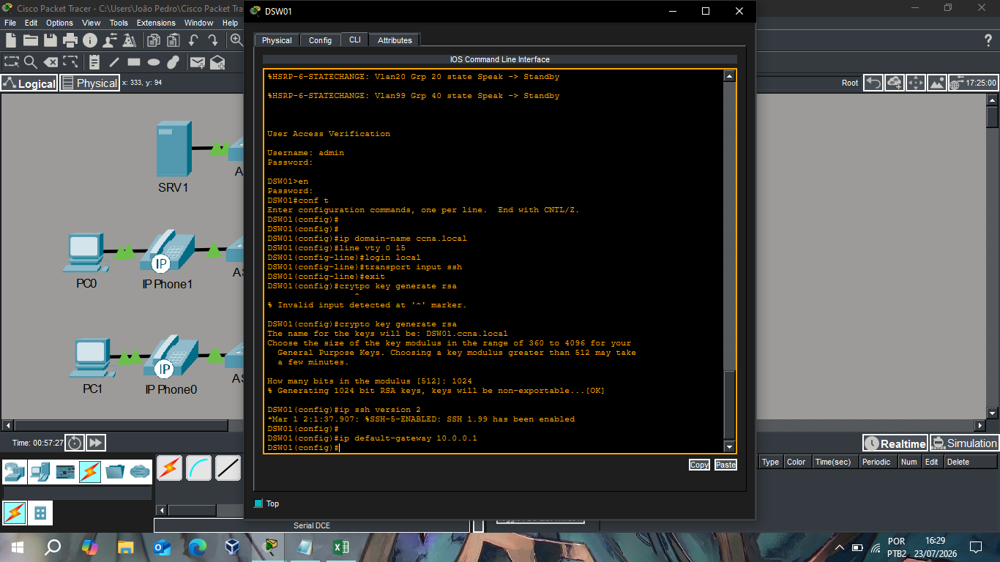
*Geração de chaves RSA, `login local`, `transport input ssh` e `ip ssh version 2`.*

### 5.2 DHCP Relay nas VLANs de usuário e voz

Como o servidor DHCP está centralizado (SRV1, na VLAN de servidores) e não local em cada switch, as SVIs das VLANs 10 e 20 recebem `ip helper-address` apontando para ele:

```
DSW01(config)#int vlan 10
DSW01(config-if)#ip helper-address 10.5.0.10
DSW01(config)#int vlan 20
DSW01(config-if)#ip helper-address 10.5.0.10
```

Isso converte os broadcasts DHCPDISCOVER recebidos em cada VLAN em unicast direcionado ao servidor (10.5.0.10), permitindo que hosts de VLANs diferentes daquela onde o servidor DHCP reside consigam obter endereço — mecanismo essencial já que, sem essa configuração, o broadcast do DHCP nunca atravessaria os limites da VLAN de origem. Essa mesma configuração deve ser espelhada no DSW02, já que qualquer um dos dois pode estar ativo (HSRP) para essas VLANs em um dado momento.

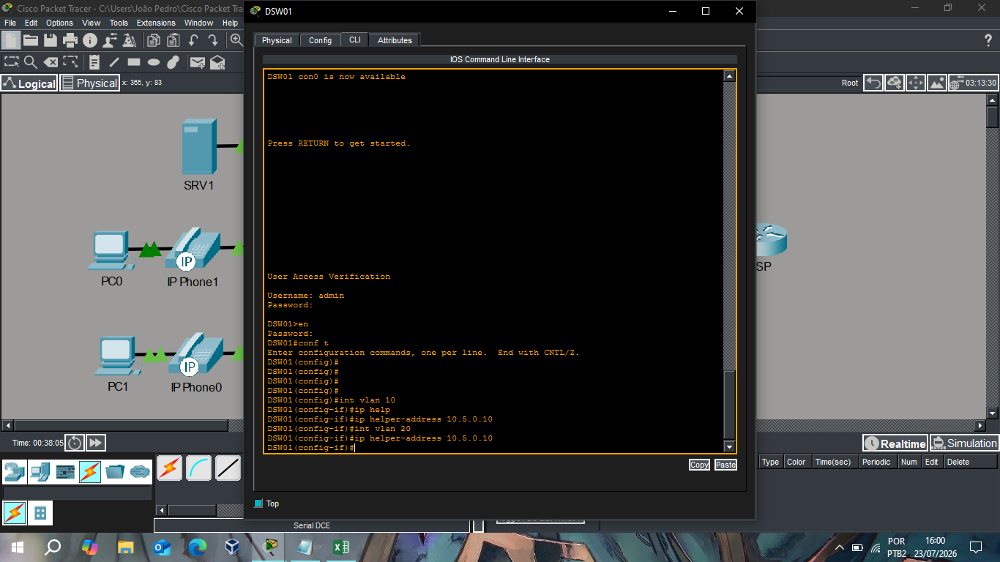
*Helper-address configurado nas SVIs das VLANs 10 e 20, apontando para o SRV1.*

### 5.3 Servidor DHCP dedicado (SRV1)

O SRV1 concentra o serviço de DHCP para múltiplas VLANs, com um pool dedicado por rede:

| Pool | Gateway | Faixa inicial | Máscara | Máx. usuários |
|---|---|---|---|---|
| serverPoolVOIP | 10.2.0.1 | 10.2.0.10 | 255.255.255.0 | 246 |
| serverPoolDATA | 10.1.0.1 | 10.1.0.10 | 255.255.255.0 | 246 |
| serverPool | — | 10.5.0.0 | 255.255.255.0 | 512 |

Os dois primeiros pools (VOIP e DATA) estão coerentes com o restante do laboratório: gateway apontando para o VIP HSRP correspondente (10.2.0.1 e 10.1.0.1) e faixa inicial reservando os primeiros endereços para atribuição estática (roteadores, switches, servidores), começando em `.10`.

**Ponto de atenção para revisão**: o terceiro pool (`serverPool`) está sem **Default Gateway** definido (`0.0.0.0`) e com a faixa inicial em `10.5.0.0` (endereço de rede, não um host válido). Caso a intenção seja usar esse pool para distribuir IPs na própria VLAN de servidores (50), vale corrigir o gateway para `10.5.0.1` (VIP HSRP dessa VLAN) e ajustar o Start IP Address para um host válido (ex: `10.5.0.10`), seguindo o mesmo padrão dos demais pools.

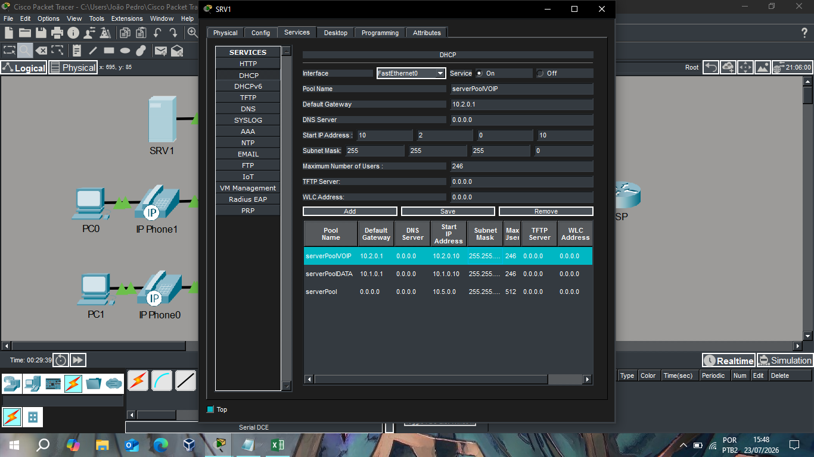
*Serviço DHCP no SRV1: pools dedicados para VOIP (VLAN 20) e DATA (VLAN 10).*

### 5.4 ACL padrão restringindo o acesso de gerência

No CSW01, a ACL definida anteriormente nesta documentação é aplicada, restringindo o acesso SSH exclusivamente ao host de gerência:

```
CSW01(config)#access-list 1 permit host 10.1.0.15
CSW01(config)#line vty 0 15
CSW01(config-line)#access-class 1 in
```

Como é uma ACL padrão numerada (`access-list 1`), ela possui um **deny implícito** ao final — qualquer origem que não seja `10.1.0.15` é automaticamente bloqueada nas linhas VTY, mesmo sem uma linha `deny any` explícita. Para fins de auditoria (registrar tentativas de acesso bloqueadas nos logs), uma melhoria opcional seria adicionar `access-list 1 deny any log` explicitamente antes de aplicar a ACL — assim cada tentativa negada gera um registro visível, em vez de ser descartada silenciosamente.

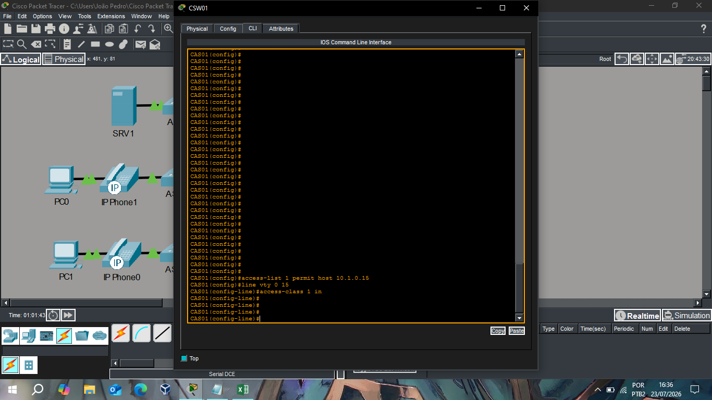
*ACL 1 aplicada nas linhas VTY, permitindo somente o host 10.1.0.15.*

### 5.5 Verificação prática: do host até o switch, via SSH

A validação de ponta a ponta é feita diretamente do PC1, cujo endereço (10.1.0.15) é exatamente o host autorizado pela ACL configurada acima:

```
IPv4 Address...: 10.1.0.15
Subnet Mask.....: 255.255.255.0
Default Gateway.: 10.1.0.1

C:\>ping 10.1.0.1

Reply from 10.1.0.1: bytes=32 time=2ms TTL=255
Reply from 10.1.0.1: bytes=32 time<1ms TTL=255
Reply from 10.1.0.1: bytes=32 time<1ms TTL=255
Reply from 10.1.0.1: bytes=32 time=24ms TTL=255

Ping statistics for 10.1.0.1:
    Packets: Sent = 4, Received = 4, Lost = 0 (0% loss)

C:\>ssh -l admin 10.0.0.2

Password:

DSW01>en
Password:
DSW01#conf t
Enter configuration commands, one per line.  End with CNTL/Z.
DSW01(config)#
```

Esse teste confirma, em sequência, várias camadas configuradas ao longo de toda a documentação:

1. **PC1 recebeu IP corretamente** (10.1.0.15) — coerente com a faixa da VLAN 10 e alcançável mesmo sem estar mostrado aqui o pool específico usado (DHCP funcionando ponta a ponta).
2. **Ping ao gateway (10.1.0.1) bem-sucedido**, com TTL=255 — confirma que o HSRP da VLAN 10 está ativo e respondendo (Capítulo 3).
3. **`ssh -l admin 10.0.0.2`** conecta com sucesso ao **DSW01, usando o IP de gerência da VLAN 99** (Capítulo 2) — validando simultaneamente o SSH (seção 5.1), a autenticação local (`username admin`) e, mais importante, que a ACL de gerência **permitiu** essa origem específica, exatamente como projetado no Capítulo anterior sobre segurança.
4. A sessão SSH sobe até o modo privilegiado (`en`) e o modo de configuração global (`conf t`) sem qualquer obstáculo adicional, confirmando que toda a cadeia de autenticação (senha de linha → senha de enable) está funcional.

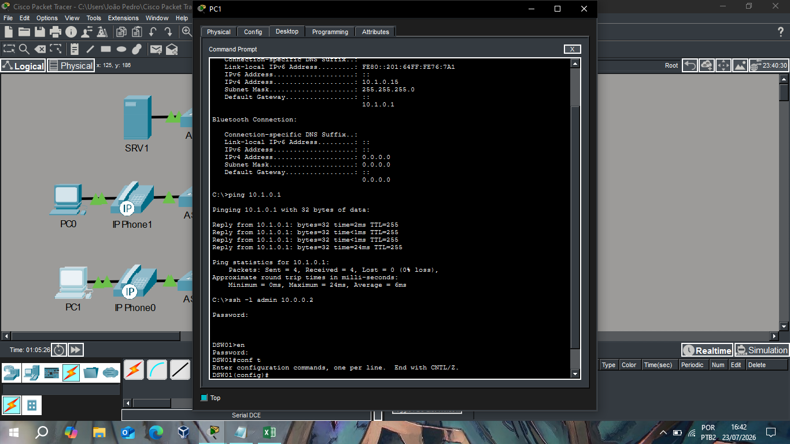
*PC1 (10.1.0.15): ping ao gateway e SSH bem-sucedido até o DSW01.*

### Encerramento da documentação

Com este capítulo, o laboratório está funcionalmente completo e validado de ponta a ponta:

| Capítulo | Escopo |
|---|---|
| 0 | Visão geral da topologia e lógica hierárquica (Acesso / Distribuição / Core) |
| 1 | Hardening inicial, VTP/VLANs, EtherChannel L2 e portas de acesso (dados/voz) |
| 2 | Interfaces roteadas, Loopbacks e EtherChannel L3 entre distribuição, core e borda |
| 3 | Spanning Tree (Rapid-PVST, PortFast, BPDU Guard) e HSRP balanceado por VLAN |
| 4 | OSPF: adjacências point-to-point, Router ID via Loopback, base para ECMP |
| 5 | SSH, ACL de gerência, DHCP relay e verificação prática ponta a ponta |

O resultado é uma rede corporativa simulada com redundância real em todas as camadas — física, Layer 2 (STP/EtherChannel), gateway (HSRP), roteamento (OSPF/ECMP) e gerência (SSH + ACL) — documentada não apenas com os comandos aplicados, mas com o raciocínio e os pequenos problemas reais encontrados (e resolvidos) ao longo do processo, que é, no fim das contas, o que mais demonstra domínio prático dos conceitos do CCNA.
